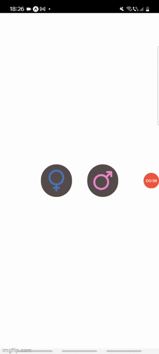
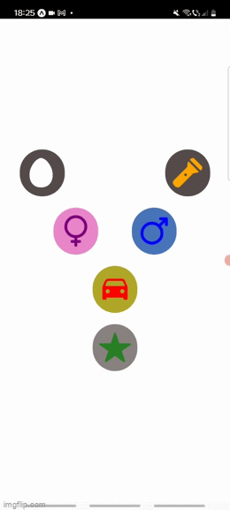
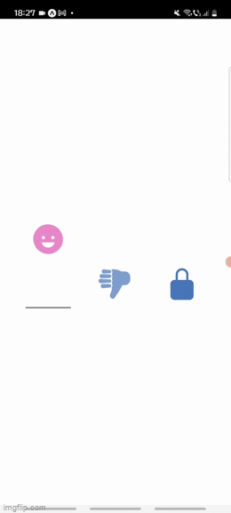

# react-native-customizable-picker


A customizable picker component for React Native which let you define a collection of choices.

Define how you want the look of the choosed options to change.

Decide from how many options are available for chosing.

  


## Getting Started

### Installing


npm i reat-native-customizable-picker


### Basic Usage

Every item that you want to be a possible choice to pick from need to be wrapped in a Choice ,
and all of them wrapped in a Chooser which is the container for all of the Choice elements.

```js
import { useState } from 'react';
import { Ionicons } from '@expo/vector-icons';
import { Chooser, Choice } from 'react-native-customizable-picker';

const Example1 = () => {
  const [choice, setChoice] = useState<string[]>([]);

  const handleChoose = (values: string[]) => {
    console.log(values)
    setChoice(values);
  }

  return (
    <Chooser handleChoose={handleChoose} style={{ flexDirection: 'row' }}>
      <Choice selectedStyle={{ backgroundColor: "#EB87CB" }}
        unselectedStyle={{ backgroundColor: "#594C4C", borderRadius: 40, padding: 10, marginHorizontal: 20 }} value="female">
        <Ionicons name="female" size={60} color={"#4B74BB"} />
      </Choice>
      <Choice selectedStyle={{ backgroundColor: "#4B74BB" }}
        unselectedStyle={{ backgroundColor: "#594C4C", borderRadius: 40, padding: 10, marginHorizontal: 20 }} value="male" >
        <Ionicons name="male" size={60} color={"#EB87CB"} />
      </Choice>
    </Chooser>
  );
}
```

### Look in the examples folder for more                                                                                                   


### Props

| Name                                            | Description                                                                                                                                                                                                                                                                                                                                                                                                                                                                                             | Details                  |
| ----------------------------------------------- | ------------------------------------------------------------------------------------------------------------------------------------------------------------------------------------------------------------------------------------------------------------------------------------------------------------------------------------------------------------------------------------------------------------------------------------------------------------------------------------------------------- | ------------------------ |
| `onValueChange`                                 | Callback which returns `value, index`                                                                                                                                                                                                                                                                                                                                                                                                                                                                   | **required**<br>function |
| `items`                                         | The items for the component to render<br> - Each item should be in the following format:<br>`{label: 'Orange', value: 'orange', key: 'orange', color: 'orange', inputLabel: 'Orange!'}`<br>- `label` and `value` are required<br>- `key`, `color`, and `inputLabel` are optional<br>- `key` will be set to equal `label` if not included<br>- `value` can be any data type<br>- If `inputLabel` exists, the TextInput will display that value instead of the `label`                                    | **required**<br>array    |
| `placeholder`                                   | - An override for the default placeholder object with a label of `Select an item...` and a value of `null`<br>- An empty object can be used if you'd like to disable the placeholder entirely                                                                                                                                                                                                                                                                                                           | object                   |
| `disabled`                                      | Disables interaction with the component                                                                                                                                                                                                                                                                                                                                                                                                                                                                 | boolean                  |
| `value`                                         | Will attempt to locate a matching item from the `items` array by checking each item's `value` property. If found, it will update the component to show that item as selected. If the value is not found, it will default to the first item.                                                                                                                                                                                                                                                             | any                      |
| `itemKey`                                       | Will attempt to locate a matching item from the `items` array by checking each item's `key` property. If found, it will update the component to show that item as selected. If the key is not found, it will attempt to find a matching item by `value` as above.                                                                                                                                                                                                                                       | string, number           |
| `style`                                         | Style overrides for most parts of the component.<br>_More details in [styling](#styling)_                                                                                                                                                                                                                                                                                                                                                                                                               | object                   |
| `pickerProps`                                   | Additional props to pass to the Picker (some props are used in core functionality so use this carefully)                                                                                                                                                                                                                                                                                                                                                                                                | object                   |
| `Icon`                                          | Custom icon component to be rendered.<br>_More details in [styling](#styling)_                                                                                                                                                                                                                                                                                                                                                                                                                          | Component                |
| `textInputProps`                                | Additional props to pass to the TextInput (some props are used in core functionality so use this carefully). This is iOS only unless `useNativeAndroidPickerStyle={false}`.                                                                                                                                                                                                                                                                                                                             | object                   |
| `touchableWrapperProps`                         | Additional props to pass to the touchable wrapping the TextInput (some props are used in core functionality so use this carefully)                                                                                                                                                                                                                                                                                                                                                                      | object                   |
| `onOpen`<br>                                    | Callback triggered right before the opening of the picker<br>_Not supported when `useNativeAndroidPickerStyle={true}`_                                                                                                                                                                                                                                                                                                                                                                                  | function                 |
| `useNativeAndroidPickerStyle`<br>_Android only_ | The component defaults to using the native Android Picker in its un-selected state. Setting this flag to `false` will mimic the default iOS presentation where a tappable TextInput is displayed.<br>_More details in [styling](#styling)_                                                                                                                                                                                                                                                              | boolean                  |
| `fixAndroidTouchableBug`<br>_Android only_      | Experimental flag to fix issue [#354](https://github.com/lawnstarter/react-native-picker-select/issues/354)                                                                                                                                                                                                                                                                                                                                                                                             | boolean                  |
| `InputAccessoryView`<br>_iOS only_              | Replace the InputAcessoryView section (bar with tabbing arrown and Done button) of the opened picker with your own custom component. Can also return `null` here to hide completely. While this bar is typical on `select` elements on the web, the [interface guidelines](https://developer.apple.com/ios/human-interface-guidelines/controls/pickers/) does not include it. View the [snack](https://snack.expo.io/@lfkwtz/react-native-picker-select) to see examples on how this can be customized. | Component                |
| `doneText`<br>_iOS only_                        | "Done" default text on the modal. Can be overwritten here                                                                                                                                                                                                                                                                                                                                                                                                                                               | string                   |
| `onUpArrow / onDownArrow`<br>_iOS only_         | Presence enables the corresponding arrow<br>- Closes the picker<br>- Calls the callback provided                                                                                                                                                                                                                                                                                                                                                                                                        | function                 |
| `onDonePress`<br>_iOS only_                     | Callback when the 'Done' button is pressed                                                                                                                                                                                                                                                                                                                                                                                                                                                              | function                 |
| `onClose`<br>_iOS only_                         | Callback triggered right before the closing of the picker                                                                                                                                                                                                                                                                                                                                                                                                                                               | function                 |
| `modalProps`<br>_iOS only_                      | Additional props to pass to the Modal (some props are used in core functionality so use this carefully)                                                                                                                                                                                                                                                                                                                                                                                                 | object                   |
| `touchableDoneProps`<br>_iOS only_              | Additional props to pass to the Done touchable (some props are used in core functionality so use this carefully)                                                                                                                                                                                                                                                                                                                                                                                        | object                   |
